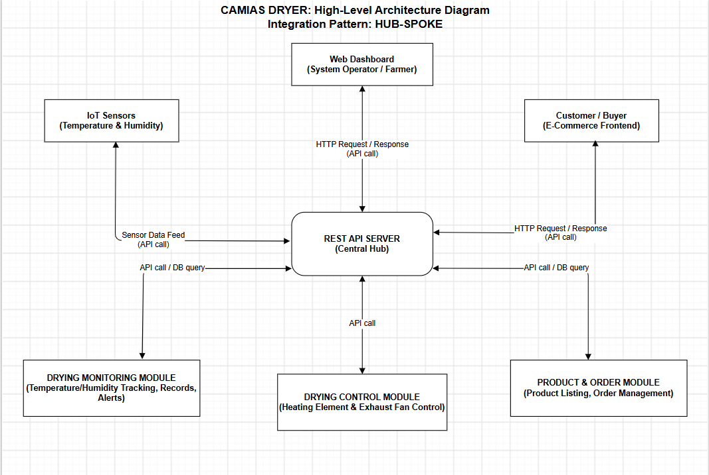

# Project Overview

## 1. System Objectives

The Camias Dryer project aims to develop an IoT-based drying system with an integrated e-commerce platform for Agrigold Farm Learning Center Inc. The system addresses the limitations of traditional sun-drying methods such as inconsistent drying conditions, manual monitoring, dependence on weather conditions, and limited market access.

Specifically, the system aims to:

- Automate and control the camias drying process using IoT technology.
- Monitor temperature, humidity, drying status, and other relevant drying data in real time.
- Provide a web-based monitoring interface for managing and reviewing drying operations.
- Integrate a solar-assisted power system to support energy-efficient and sustainable drying.
- Provide an e-commerce platform for displaying, managing, and selling dried camias products online.

## 2. Proposed Scope

### Modules/Systems to Integrate

- IoT-Based Drying System
- Temperature and Humidity Monitoring
- Automated Heating and Airflow Control
- Real-Time Monitoring Dashboard
- Drying Records and History
- Product and Inventory Management
- E-Commerce and Online Ordering
- Notifications and Reports
- Firebase Cloud Database

### In-Scope Features

- User authentication and secure system access
- Real-time monitoring of temperature and humidity
- Automated control of the heating element and ventilation fan
- Monitoring of drying progress and system status
- Recording and viewing of drying history
- Product listing and management
- Inventory management
- Online product ordering
- Order management and tracking
- Notifications and system alerts
- Solar-assisted power integration
- Real-time synchronization of data through Firebase

### Out-of-Scope

- Industrial-scale mass production
- Processing of fruits and vegetables other than camias
- Advanced delivery and logistics management
- Integrated payment processing
- Large-scale commercial deployment

## 3. Stakeholders

- **Agrigold Farm Learning Center Inc.** — The primary beneficiary and system owner who will use the system for drying operations, monitoring, product management, and online selling.
- **System Administrator/Staff** — Responsible for monitoring the drying process, managing system data, products, inventory, and orders.
- **Customers** — Users who can browse available dried camias products and place orders through the e-commerce platform.
- **Local Farmers** — Potential beneficiaries who may benefit from improved camias preservation, reduced post-harvest losses, and wider market opportunities.

## 4. Tools & Technologies

### Languages/Frameworks

- HTML
- CSS
- JavaScript
- React
- Node.js

### IoT and Hardware Development

- ESP32 Microcontroller
- Temperature and Humidity Sensors
- HX711 Load Cell Amplifier
- Heating Element
- Ventilation Fan
- Relay Module
- Solar Panel
- Solar Charge Controller
- DC-DC Buck Converter
- Arduino IDE / PlatformIO

### Database and Backend

- Firebase Realtime Database
- Firebase Authentication
- Firebase Hosting

### Integration Approach

- IoT-based real-time data communication
- Wi-Fi connectivity
- Cloud-based data synchronization
- Integration between the dryer hardware, Firebase backend, web/mobile application, and e-commerce platform

### Repository and Development Services

- GitHub
- Visual Studio Code
- Firebase

### UI/UX and Testing Tools

- Figma
- Postman
- Google Chrome

## 5. Integration Pattern Applied

### Integration Pattern

**Hub-Spoke**

### Rationale

The Hub-Spoke integration pattern is appropriate for the Camias Dryer system because the REST API Server acts as the central hub for communication between the system modules. The IoT Sensors send sensor data through the API, while the Web Dashboard retrieves information from the central hub for monitoring. The Drying Monitoring Module and Drying Control Module also communicate through the REST API Server. The Product & Order Module and E-Commerce Frontend use API calls and database queries through the central hub. This pattern reduces direct dependencies between modules and provides a centralized way to manage communication within the system.

### Diagram Reference

## 6. Messaging Workflow

The Camias Dryer system uses a message-oriented middleware workflow to support asynchronous communication between the Drying Monitoring Module and the Drying Control Module. When a drying batch request is submitted, the Producer places the request into an in-memory message queue. The Consumer asynchronously retrieves the queued messages and processes each drying request one at a time. For the demonstration, drying batches with a weight of 10 kg or below are accepted, while batches above 10 kg are rejected. This producer-consumer approach reduces direct dependency between modules and demonstrates asynchronous messaging within the Camias Dryer system.

## 7. High-Level System Overview

### 7.1 Major Modules/Subsystems

**Drying Monitoring Module**  
Collects and displays temperature and humidity data from the IoT sensors to monitor the drying process in real time.

**Drying Control Module**  
Manages the drying operation based on configured drying settings and control commands such as start, pause, and stop.

**Product and Order Management Module**  
Manages Camias products, product information, customer orders, and order records for the e-commerce component of the system.

**Payment Processing Module**  
Handles payment requests and receives payment status from the payment gateway for customer transactions.

### 7.2 External Systems/Interfaces

The Camias Dryer system interacts with the following external systems and interfaces:

- **IoT Sensors** – provide temperature and humidity readings for drying monitoring.
- **Payment Gateway** – processes customer payment requests and returns payment status.
- **User/Customer Interface** – allows customers to view products, place orders, and receive order confirmations.
- **Firebase Realtime Database** – stores and synchronizes system data in real time.
- **REST API** – provides communication between the system modules and client applications.

### 7.3 Data Flow Summary

Data flows through the Camias Dryer system from the IoT sensors, users, and external services. IoT sensors send temperature and humidity readings to the Drying Monitoring Module for real-time monitoring and storage. The Owner can view monitoring information and send drying settings and control commands to the Drying Control Module. For the e-commerce component, customers access product information, submit orders, and provide payment information through the Product and Order Management Module. The system communicates with the Payment Gateway to process transactions and receives the payment status for order confirmation.
